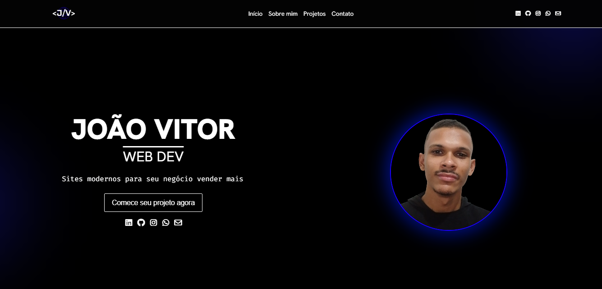

# João Vitor | Web Dev

Portfólio pessoal desenvolvido para apresentar projetos, habilidades e informações de contato de forma profissional.

## Sobre
Site pessoal criado para centralizar e exibir meus trabalhos como desenvolvedor web. A aplicação conta com uma interface responsiva e moderna, apresentando uma seção "Sobre Mim", galeria de projetos com links para repositórios e demos, além de meios de contato. É o ponto central para demonstrar minha evolução técnica e experiências.

### Imagens do projeto:

### Demo
Acesse a demo ao vivo aqui: [Link para Demo](https://joaovitor-webdev.netlify.app)

## Tecnologias
- HTML5
- CSS3 
- JavaScript
- Font Awesome (via CDN)
- Google Fonts (via importação CSS)

## Como Usar
Opção 1 — Abrir diretamente
- Baixe/clones este repositório.
- Abra o arquivo index.html no navegador.

Opção 2 — VS Code (Live Server)
- Instale a extensão Live Server
- Clique em  Go Live dentro do index.html

## Estrutura
- index.html: Estrutura semântica e conteúdo principal
- assets: pasta contendo imagens e outros recursos
  - images: pasta com imagens usadas no site
- styles: pasta contendo arquivos CSS para estilização
  - about.css: estilos para a seção "Sobre Mim"
  - contact.css: estilos para a seção de contato
  - home.css: estilos para a página inicial
  - navbar.css: estilos para a barra de navegação
  - projects.css: estilos específicos para a seção de projetos
  - style.css: estilos principais do site
  - mobile: estilos responsivos para dispositivos móveis
    - about-mobile.css: estilos responsivos para a seção "Sobre Mim"
    - contact-mobile.css: estilos responsivos para a seção de contato
    - home-mobile.css: estilos responsivos para a página inicial
    - navbar-mobile.css: estilos responsivos para a barra de navegação
    - projects-mobile.css: estilos responsivos para a seção de projetos
  - tablet: estilos responsivos para tablets
    - about-tablet.css: estilos responsivos para a seção "Sobre Mim"
    - home-tablet.css: estilos responsivos para a página inicial
    - navbar-tablet.css: estilos responsivos para a barra de navegação 
- script: pasta contendo arquivos JavaScript
  - contact.js: funcionalidades para a seção de contato
  - navbar.js: funcionalidades para a barra de navegação
  - typing.js: funcionalidades de digitação animada na página inicial

## Scripts
Este projeto não possui package.json nem scripts de npm/yarn; é um app estático e pode ser executado diretamente no navegador.

## Autor
- Nome: João Vitor - Web Dev
- GitHub: https://github.com/joaovitor-webdev
- Portfólio: https://joaovitor-webdev.netlify.app